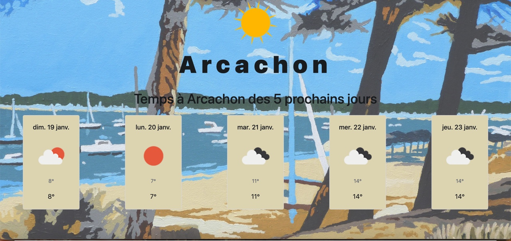
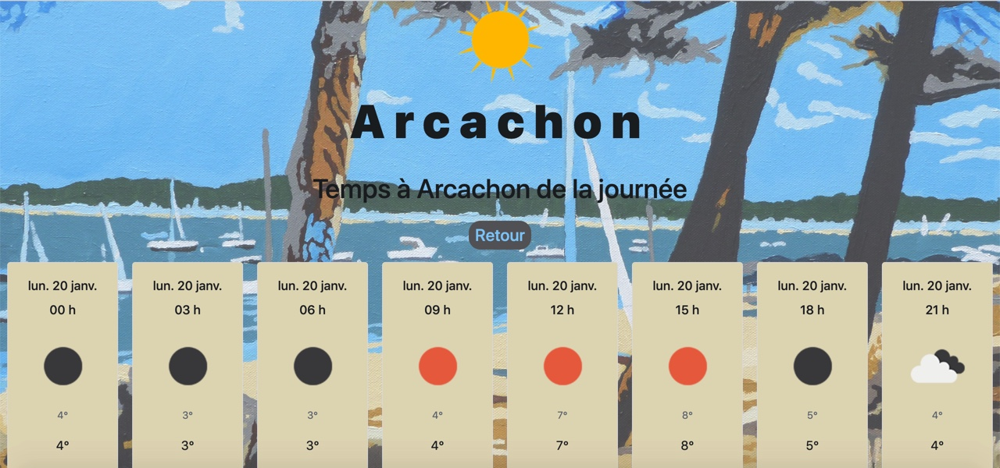

    
  </a>

<h1 align="center">
  Weather-App
</h1>

Bienvenue dans l'application météo d'Arcachon ☀️☀️

L'application météo d'Arcachon vous permet de visualiser la météo de la semaine de la ville.
Pour des informations météorologiques plus précises de la journée je vous invite à cliquer sur chacune des cartes de la journée. 🏖️⛵🏄

## Stack utilisé pour cette webapp 🍁🍁

1.  **React Hooks**
    

2.  **TypeScript**
    

3.  **Bootsrap**
    

## Pour lancer mon application 🚀🚀

Je vous invite à utiliser ces deux commandes:

### `npm start`

### `npm run build`
